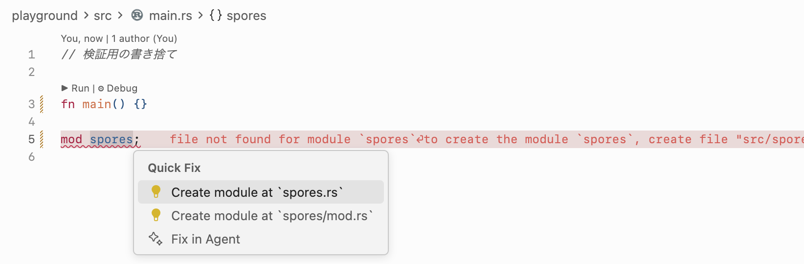

推移依存クレート: 依存クレートの依存クレート

ライブラリ: main がない (rlib ファイルが作られる)

バイナリ: main がある。実行可能。

以下を多用していきたい



一般的には、タイプやトレイトやモジュールをインポートし、関数や定数やその他の要素には相対パスでアクセスするのが良いスタイルであるとされる。

```rust
use std::mem; // モジュールのインポート

if s1 > s2 {
    // 関数は相対パスでアクセス
    mem::swap(&mut s1, &mut s2);
}
```

#[cfg] は configuration という意味

テストがサポート用のコードを必要とするほど大きくなってきたら、tests モジュールを作って、モジュール全体をテスト時にしかコンパイルされないように、#[cfg] 属性で設定するのが慣例となっている。

`//!` で始まるコメントはモジュール or クレート全体に対して付与される
