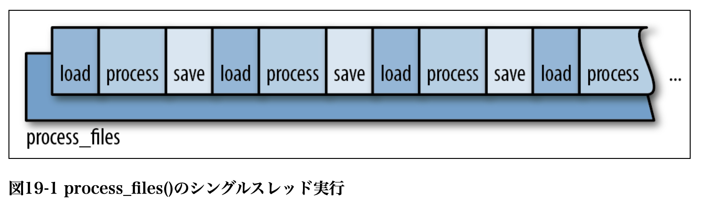
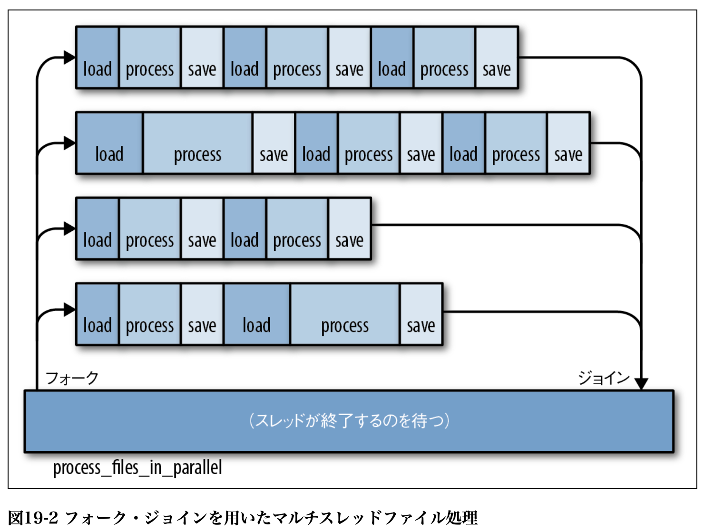

# 並列性

## フォーク・ジョイン並列

```rust
fn process_files(filenames: Vec<String>) -> io::Result<()> {
    for document in filenames {
        let text = load(&document)?; // ソースファイルを読み込む
        let results = process(text); // 統計値を計算
        save(&document, results)?; // 出力ファイルに書き出す
    }
    Ok(())
}
```



上記を下記のようにする



- 関数 `std::thread::spawn` は新しいスレッドを起動する

## スレッド安全性：Send と Sync

- Send を実装する型は他のスレッドに値で渡しても安全だ。スレッド間で移動することもできる。
- Sync を実装する型は他のスレッドに非 mut 参照で渡しても安全だ。スレッド間で共有することができる。
