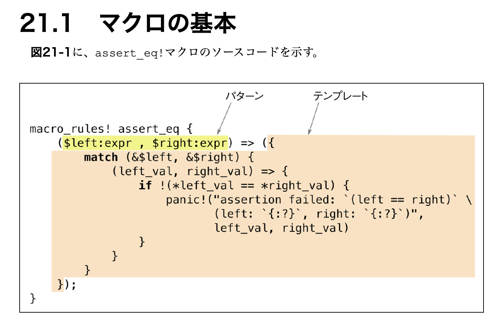

# マクロ

- 関数だけではできないような言語拡張が、マクロでなら実現できる
  - 例: assert_eq! がファイル名と行番号を含んだエラーメッセージを出力することなど
- マクロは何らかの Rust コードに変換される



```rust
// 値を N 回繰り返す
let buffer = vec![0_u8; 1000];

// カンマで区切られた値のリスト
let noodles = vec!["udon", "ramen", "soba"];

macro_rules! vec {
    ($elem:expr ; $n:expr) => {
        ::std::vec::from_elem($elem, $n)
    };
    ( $( $x:expr ),* ) => {
        <[_]>::into_vec(Box::new([ $( $x ),* ]))
    };
    ( $( $x:expr ),+ ,) => {
        vec![ $( $x ),* ]
    };
}
```
